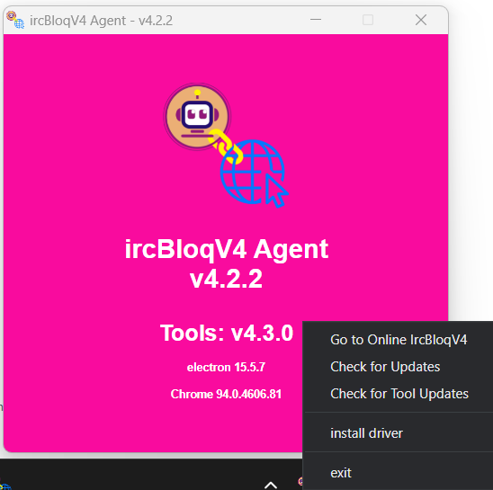

# ircbloq-link-releases
# ircBloqV4-link

  

ircBloqv4 Link is an application that provides local hardware connection support for ircBloqV4 online web pages.

## Getting Start

Visit the wiki: [https://ircbloqcc.github.io/wiki](https://ircbloqcc.github.io/wiki)

## Bug Report

You can submit the bug log in issues of this project.

## Credits to Openblockcc
